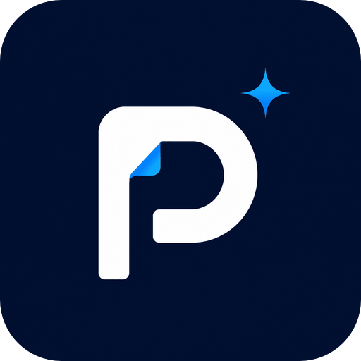
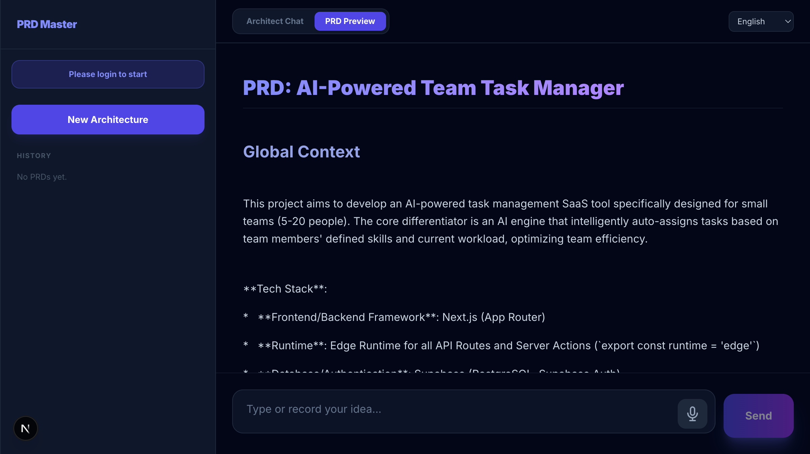
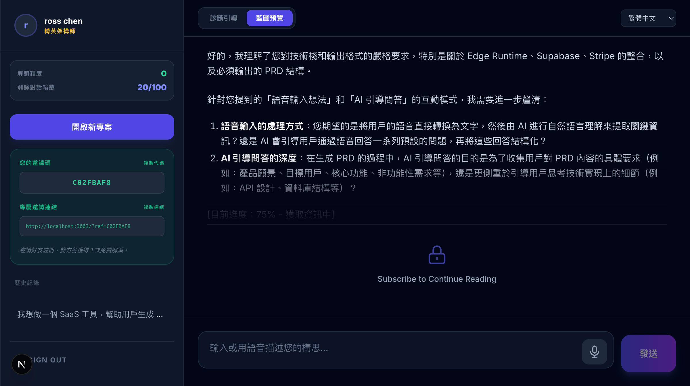
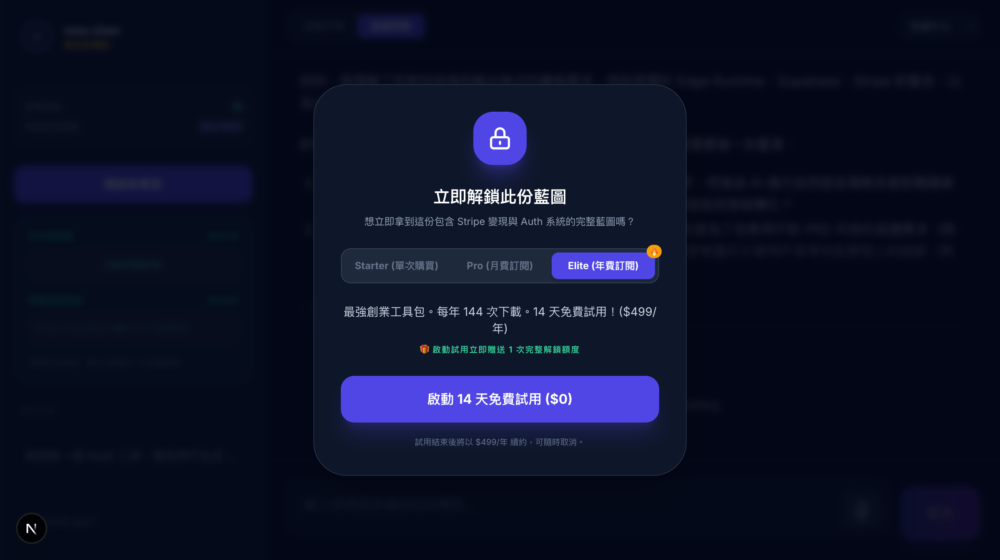

# PRD Master

---
## **Stop Building the Wrong Thing. Turn your ideas into a structured PRD that AI agents can actually execute.**

> [!TIP]
> **[Try it Now: soluneai.com/prd-master](https://soluneai.com/prd-master)**
> **Get 3 Free PRD generations automatically upon sign-in.**

---

### 🌈 Output Demos
*PRDs below are 100% generated from a single idea prompt.*

#### 1. Streaming PRD Generation
*Watch your requirements take shape in real-time, section by section.*

#### 2. Structured Document View
*Clean, agent-ready PRD with every detail an AI coding tool needs.*

#### 3. Live Generation in Progress
*Confidence scoring and category diagnosis built in — no guesswork.*

---

## ⚡ The Problem: "Vibe-Driven Development Gone Wrong"
When you hand an AI a vague idea like "build me a SaaS dashboard," it often:
1.  **Invents requirements**, building features you never asked for.
2.  **Skips edge cases** — auth flows, error states, pricing logic — until they blow up in prod.
3.  **Wastes your quota** — rounds of back-and-forth corrections burn tokens faster than the actual build.

`PRD Master` is the specification engine that kills ambiguity before the first line of code is written.

## 🚀 How it Works
PRD Master acts as a **Requirement Intelligence Layer**. It transforms your raw idea into a production-grade PRD with:
* **Operational Mode Detection**: Automatically adapts output for Personal vs. Commercial projects.
* **Confidence Scoring**: Flags ambiguous requirements before they become bugs.
* **8-Section Architecture**: Anti-bot flows, billing logic, UI specs, data schema — all generated, nothing assumed.
* **Agent-Optimized Format**: Output is structured so Claude Code, Cursor, and Windsurf execute with zero misinterpretation.

## 📦 Part of The Vibe Stack
This project is a core component of [The Vibe Stack](https://github.com/solune-lab/the-vibe-stack) — a production-ready survival kit for frugal developers.

* **Brain**: [Vibe Coding Rules](https://github.com/solune-lab/the-vibe-stack#a-brain-vibe-coding-rules)
* **Nerve**: [Glue Code Puzzles](https://github.com/solune-lab/the-vibe-stack#b-nerve-glue-code-puzzles-quick-start)
* **Mouth**: [Vibe Coding Translator](https://github.com/solune-lab/vibe-coding-translator)
* **Blueprint**: **PRD Master** (You are here)

## 🛠️ Usage
1.  Access the tool: [soluneai.com/prd-master](https://soluneai.com/prd-master)
2.  Describe your idea (e.g., *"A SaaS tool that helps freelancers track invoices with Stripe and email reminders"*).
3.  Get your **Agent-Ready PRD** — a structured specification covering architecture, auth, billing, UI, and edge cases.
4.  Paste it into your Agent and **build the right thing the first time**.

---

## 🤝 Contributing

Have a prompt template or output format improvement? PRs are always welcome!

## 🌟 Support & Connect

If this tool saved you from building the wrong thing, please give this repository a 💫**Star**!

### 📢 Stay Updated
* **Twitter / X**: [@soluneai](https://x.com/soluneai)
* **Threads**: [@soluneai_com](https://www.threads.net/@soluneai_com)

---
*Built by a frugal developer, for frugal developers. Stay efficient.*
